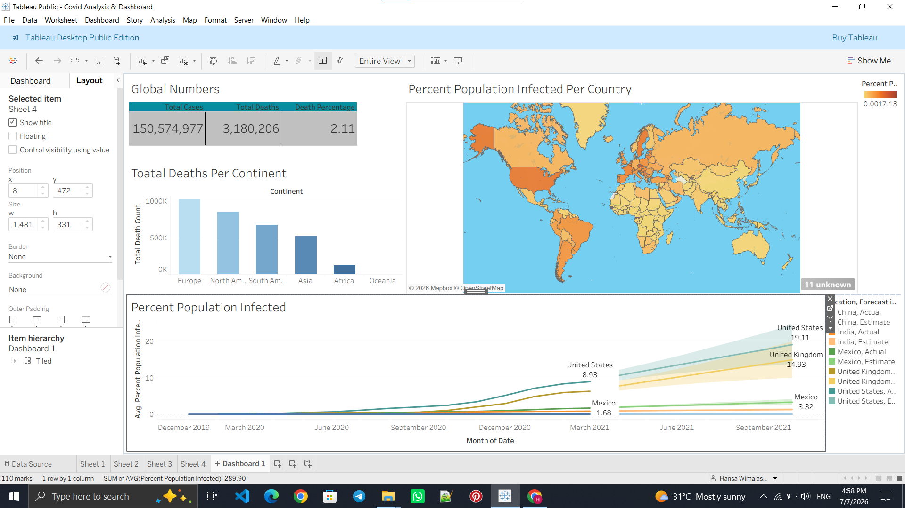

# 🌍 COVID-19 Data Analysis & Interactive Dashboard


---

## 📌 Project Overview

This project presents a comprehensive analysis of global COVID-19 data using SQL for data exploration and Tableau for interactive data visualization.

The objective was to transform raw COVID-19 datasets into meaningful insights by performing data cleaning, exploratory data analysis (EDA), trend analysis, and dashboard development.

The project demonstrates practical data analytics skills including SQL querying, data aggregation, KPI creation, and business intelligence dashboard design.

---
# 📷 Dashboard Preview



## 🎯 Project Objectives

- Analyze worldwide COVID-19 cases and deaths
- Examine infection and mortality trends
- Calculate infection percentages by country
- Compare vaccination progress across countries
- Develop an interactive Tableau dashboard
- Present data-driven insights through visual storytelling

---

# 🛠 Technologies Used

| Technology | Purpose |
|------------|----------|
| SQL Server | Data Cleaning & Analysis |
| Tableau | Dashboard Development |
| Excel | Data Source |
| Git & GitHub | Version Control |

---

# 📂 Project Structure

```
COVID-19-Data-Analysis/
│
├── SQLQuery.sql
├── Covid Analysis & Dashboard.twb
├── Dataset/
│   └── CovidData.xlsx
│
├── Dashboard Screenshots/
│   ├── Dashboard.png
│   ├── Overview.png
│   └── Trends.png
│
└── README.md
```

---

# 📊 SQL Analysis

The SQL analysis includes:

- Data Exploration
- Data Cleaning
- Aggregate Functions
- Window Functions
- Common Table Expressions (CTEs)
- Joins
- Temporary Tables
- Views
- Rolling Vaccination Calculations
- Percentage Calculations
- Country-wise Comparisons
- Global Statistics

---

# 📈 Dashboard Features

The Tableau dashboard provides interactive visualizations including:

### 📌 Global Overview

- Total Cases
- Total Deaths
- Total Vaccinations
- Death Percentage

### 🌍 Country Analysis

- Highest Infection Rate
- Highest Death Count
- Country Comparison
- Vaccination Progress

### 📅 Trend Analysis

- Daily Cases
- Daily Deaths
- Time Series Analysis
- Pandemic Growth Trends

### 📊 Interactive Filters

- Country Selection
- Date Range
- Dynamic Visualizations

---

# 💡 Key Insights

- Countries with the highest infection rates
- Countries with the highest mortality
- Vaccination rollout comparison
- Global pandemic progression
- Daily case trends
- Infection percentage by population
- Rolling vaccination analysis

---

# 📁 Files Included

| File | Description |
|------|-------------|
| SQLQuery.sql | SQL scripts used for analysis |
| Covid Analysis & Dashboard.twb | Tableau dashboard |
| Dataset | Source data |
| Dashboard Screenshots | Dashboard images |
| README.md | Project documentation |

---

# 🚀 Skills Demonstrated

This project showcases:

- SQL Query Writing
- Data Cleaning
- Exploratory Data Analysis (EDA)
- Data Aggregation
- Window Functions
- Common Table Expressions (CTEs)
- Tableau Dashboard Development
- Data Visualization
- Business Intelligence
- Analytical Thinking

---

# 📚 Learning Outcomes

During this project I gained hands-on experience in:

- Writing complex SQL queries
- Creating reusable SQL views
- Building KPI-driven dashboards
- Performing real-world data analysis
- Designing interactive Tableau dashboards
- Communicating insights through visual storytelling

---

# 🎯 Business Value

This dashboard enables users to:

- Monitor pandemic trends
- Compare country performance
- Analyze vaccination progress
- Identify high-risk regions
- Support data-driven decision making

---

## 👨‍💻 Author

**Hansa Wimalasena**

Bachelor of Applied Mathematics & Computing

Aspiring Data Analyst | SQL | Tableau | Power BI | Python | Excel

---

## ⭐ Support

If you found this project useful, please consider giving it a ⭐ on GitHub.

It motivates me to continue building more data analytics projects!
